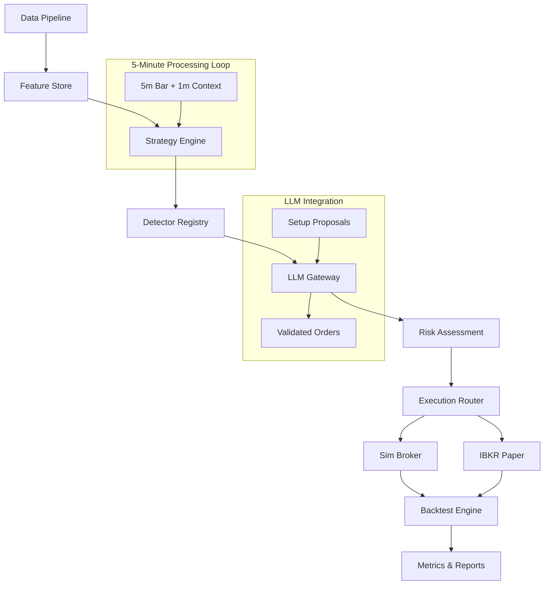

# PSE-LLM: Python Strategy Engine with LLM Integration

[](https://www.python.org/downloads/)
[](LICENSE)
[](tests/)
[](https://black.readthedocs.io/en/stable/)

A sophisticated quantitative trading system that combines traditional technical analysis with Large Language Model (LLM) integration for optimal trade decision making. Built for futures markets with a focus on Smart Money Concepts (SMC) and deterministic execution.

## 🚀 Features

### Core Capabilities
- **Multi-Tactic Detection**: 5 specialized trading tactics (DAS 2.1, DAS 2.2, TCEA-FVG-MR, TCEA-SPMF v3, TCEA-MTE)
- **LLM Integration**: OpenAI, Anthropic, and Gemini support with JSON-only guardrails
- **Deterministic Execution**: Reproducible results with seed-based randomization
- **Risk Management**: Universal SL caps, position sizing, and drawdown controls
- **Backtesting & Forensics**: No-look-ahead validation and comprehensive audit trails
- **Paper Trading**: IBKR integration for live simulation
- **Real-time Monitoring**: Rich CLI interface with progress tracking

### Architecture Highlights
- **Event-Driven Engine**: 5-minute bar processing with 1-minute context windows
- **Modular Design**: Pluggable detectors, kernels, and execution layers
- **Type Safety**: Full Pydantic v2 models with strict validation
- **Performance**: Numba-optimized calculations and DuckDB analytics
- **Observability**: Structured logging and comprehensive metrics

## 📊 System Architecture



## 🛠️ Installation

### Prerequisites
- Python 3.11+
- IBKR TWS or Gateway (for paper trading)
- API keys for data providers and LLM services

### Quick Setup
```bash
# Clone and setup
git clone <repository-url>
cd pse-llm
make setup

# Configure environment
cp .env.example .env
# Edit .env with your API keys

# Run initial checks
make lint type test
```

### Development Setup
```bash
make setup-dev
make install-pre-commit
```

## 🎯 Trading Tactics

### DAS 2.1 — MSS + FVG POI Retest
**Opportunity**: Fresh MSS creates FVG imbalance; shallow retest to POI aligns with structure.

**Entry**: 5m MSS with MQS ≥ min; valid FVG (width/staleness bounds); retest hits POI.

**Exit**: SL at opposite FVG edge ± buffer; TP1 via kernel; partials per policy.

**Sizing**: A+→1.0R, A→0.75R, B→0.5R.

### DAS 2.2 — Liquidity Sweep & Reversal
**Opportunity**: Significant sweep precedes reversal MSS; FVG + POI retest gains evidentiary weight.

**Entry**: Tag FVG as post-sweep; reuse DAS 2.1 rules; rebrand when sweep context present.

**Exit**: Same as DAS 2.1; annotate sweep metadata.

**Sizing**: Same as DAS 2.1; +25% boost if sweep priority high and MQS ≥ A.

### TCEA-FVG-MR — Missed FVG Mean Reversion
**Opportunity**: FVG midpoint never filled but price reacted strongly (≥1R).

**Entry**: TCC active; prior missed FVG; reaction strength ≥ threshold; 1m pullback breakout.

**Exit**: SL at 1m pullback swing ± buffer; TP1 via kernel; invalidate if TCC downgrades.

**Sizing**: Start 0.75× base; bump to 1.0× if reaction ≥1.5R and A+.

### TCEA-SPMF v3 — Smart Pullback & Micro-FVG
**Opportunity**: In strong trend, impulse → rhythmic pullback with micro-FVGs.

**Entry**: TCC Medium/High; impulse leg identified; retracement within bounds; 5m close breaks PB structure.

**Exit**: SL beyond PB extreme + buffer; TP1 via kernel; A+ lifts priority.

**Sizing**: 0.75–1.0× DAS2.1 depending on PB depth & MQS.

### TCEA-MTE — Momentum Thrust Entry
**Opportunity**: With high trend conviction, thrust bar/MSS breaks SR.

**Entry**: TCC High; thrust bar breaks SR or fresh MSS with high MQS; entry at first 1m of next 5m period.

**Exit**: SL beyond trigger bar extreme + buffer; enforce caps; optional momentum trailing.

**Sizing**: Conservative 0.5× base R; allow 1.0× only if TCC High, MQS A+, spread/latency ok.

## 📈 Usage Examples

### Data Ingestion
```bash
# Ingest historical data
pse ingest --provider databento --symbol ES --start 2024-01-01 --end 2024-12-31

# Build feature store
pse build-features --symbol ES --timeframe 1m,5m
```

### Backtesting
```bash
# Run backtest with specific configuration
pse backtest --symbol ES --start 2024-01-01 --end 2024-12-31 --config configs/settings.yaml --report results/ES_bt.html --seed 42

# Walk-forward optimization
pse wfo --symbol ES --folds 6 --params configs/settings.yaml
```

### Paper Trading
```bash
# Start paper trading session
pse paper --symbol ES --route IBKR --account DUXXXXXXX
```

### LLM Validation
```bash
# Validate LLM contracts with sample data
pse validate-llm --sample outputs/sample_setups.json
```

## 🔧 Configuration

### Core Settings (`configs/settings.yaml`)
```yaml
trading:
  symbols:
    - symbol: "ES"
      tick_size: 0.25
      point_value: 50.0

detectors:
  das21:
    swing_lookback: 20
    min_bars_between: 5
    retest_tolerance: 0.002

risk:
  max_r_per_trade: 0.01
  max_daily_loss: 0.03
  sl_caps:
    es: 8.0

llm:
  provider: "openai"
  model: "gpt-4o-mini"
  temperature: 0.1
```

### Risk Policies (`configs/risk_policies.yaml`)
```yaml
max_concurrent_risk: 0.05
spread_tolerance: 0.5
latency_threshold_ms: 100
news_blackout_periods:
  - start: "08:00"
    end: "09:30"
    reason: "Economic data releases"
```

## 🧪 Testing & Quality Assurance

### Test Structure
```
tests/
├── conftest.py              # Shared fixtures
├── test_engine_smoke.py     # End-to-end smoke tests
├── test_detectors.py        # Tactic-specific tests
├── test_backtest_audit.py   # No-look-ahead validation
├── test_llm_contracts.py    # LLM integration tests
└── test_ibkr_paper.py       # Broker integration tests
```

### Running Tests
```bash
# All tests
make test

# With coverage
make test-cov

# Specific test categories
make test-unit
make test-integration
```

### Forensics & Determinism
- **No Look-Ahead**: All derived fields use info ≤ current bar close
- **Threshold Ordering**: Deterministic inequalities prevent edge cases
- **NaN Hygiene**: Warm-up periods and validation prevent NaN propagation
- **Seed-Based Runs**: `--seed` parameter ensures reproducible results

## 📊 Metrics & Reporting

### Performance Metrics
- **Trade Statistics**: Win rate, profit factor, average R:R
- **Risk Metrics**: Sharpe ratio, max drawdown, recovery factor
- **Per-Tactic Attribution**: Performance breakdown by tactic
- **Market Condition Analysis**: Performance across different TCC/MCS states

### Report Formats
- **HTML Reports**: Interactive charts and detailed trade logs
- **JSON Artifacts**: Machine-readable results for further analysis
- **CSV Exports**: Trade history for external analysis tools

## 🔒 Risk Management

### Universal SL Caps
- **ES**: 8 points max SL
- **NQ**: 20 points max SL
- **RTY**: 6 points max SL

### Position Sizing
- **Method**: Fixed risk percentage per trade
- **Account Risk**: 1% max per trade
- **Minimum R:R**: 1.5 for all setups

### Execution Guards
- **Spread Tolerance**: Skip if spread > 0.5 ticks
- **Latency Threshold**: Cancel if > 100ms round-trip
- **News Blackout**: Automatic pause during economic events

## 🤖 LLM Integration

### Supported Providers
- **OpenAI**: GPT-4, GPT-4o-mini
- **Anthropic**: Claude-3, Claude-3.5
- **Google**: Gemini Pro, Gemini Pro Vision

### LLM Roles
1. **Validator**: Reviews PSE proposals, approves/rejects/modifies
2. **Holistic Proposer**: Suggests setups not detected by PSE
3. **Risk Officer**: Vetoes trades violating risk policies

### JSON-Only Contract
```json
{
  "validations": [
    {
      "proposal_id": "uuid",
      "verdict": "approve|reject|revise",
      "priority": 0.0,
      "reason": "terse explanation",
      "risk_flags": {
        "sl_cap_violation": false,
        "news_blackout": false
      },
      "edits": {
        "entry": null,
        "sl": null,
        "tp1": null
      }
    }
  ],
  "holistic_proposals": [...],
  "risk_decisions": [...]
}
```

## 🚀 Deployment

### Docker
```bash
# Build image
make docker-build

# Run container
make docker-run
```

### Production Setup
```bash
# Install production dependencies
pip install -e .

# Configure for production
export ENV=production
export LOG_LEVEL=WARNING

# Start trading system
pse paper --symbol ES --route IBKR --account YOUR_ACCOUNT
```

## 📚 Documentation

### Additional Resources
- [API Reference](docs/api.md)
- [Configuration Guide](docs/configuration.md)
- [Backtesting Guide](docs/backtesting.md)
- [LLM Integration Guide](docs/llm_integration.md)
- [Risk Management](docs/risk_management.md)

### Development
```bash
# Generate docs
make docs

# Serve docs locally
make serve
```

## 🤝 Contributing

1. Fork the repository
2. Create a feature branch
3. Make your changes
4. Add tests for new functionality
5. Ensure all tests pass: `make test`
6. Submit a pull request

### Development Guidelines
- Follow PEP 8 style guidelines
- Add type hints for all functions
- Write comprehensive docstrings
- Add unit tests for new features
- Update documentation for API changes

## 📄 License

This project is licensed under the MIT License - see the [LICENSE](LICENSE) file for details.

## ⚠️ Disclaimer

This software is for educational and research purposes only. Use at your own risk. The authors are not responsible for any financial losses incurred through the use of this software.

## 🙏 Acknowledgments

- Smart Money Concepts (SMC) community
- IBKR API documentation
- Open source quantitative trading libraries

---

**Built with ❤️ for the quantitative trading community**
